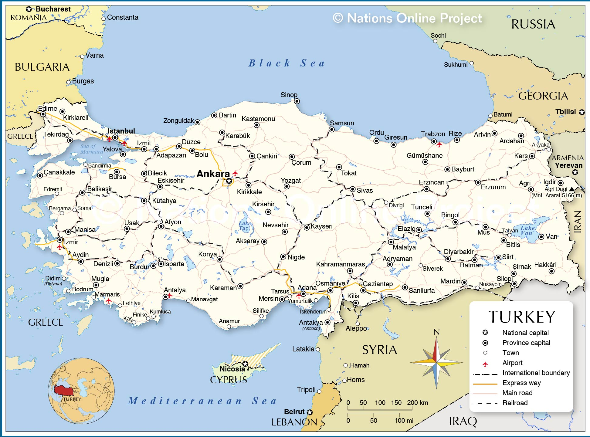

<!-- @import "[TOC]" {cmd="toc" depthFrom=1 depthTo=6 orderedList=false} -->

<!-- code_chunk_output -->

- [Spark Project Report1](#spark-project-report1)
    - [E1](#e1)
    - [E1-2](#e1-2)
    - [E2](#e2)
    - [E3](#e3)
    - [E4](#e4)
    - [E5](#e5)
    - [N1](#n1)
    - [N2&3](#n23)
    - [N4](#n4)
    - [N5](#n5)

<!-- /code_chunk_output -->

# Spark Project Report1
### E1

#### Method {ignore=TRUE}
Male in Turkish is 'Erkek' and female in Turkish is 'Kadın'. So male is represented by 'E'. I filtered the records with gender 'E' and map every element to (birthday, name). Birthday was turned into integers to help with sorting.
#### Analysis {ignore=TRUE}
The result shows that the oldest man in Turkey, Celil Unal, was born on Sep 20,1329. This is rediculous and must have been a wrong record.
### E1-2
#### Method {ignore=TRUE}
Map elements to (birthday, 1) and then reduce and sort
#### Analysis {ignore=TRUE}
'1/1/1966' is the most popular birthdate, while '2/9/1909','8/2/1910',etc. are the least popular birthdates.The least popular birthdates are relatively early. I also found that the most popular birthday is '1/1', which might be because the default birthday was set to '1/1'.The least popular birthdate also include some obviously wrong records such as: '0/1/1963'.
### E2
#### Method {ignore=TRUE}
Map elements to (char in name, 1), reduce and sort.
#### Analysis {ignore=TRUE}
The most popular character in name is A.

### E3
#### Method {ignore=TRUE}
Map elements to (age, 1) and reduce.
#### Analysis {ignore=TRUE}

Since the dataset does not have records of people under 18, we could not know the number of people aged 0-18. According to the result, the most populous age range is mid-aged(29-38) and old (>=60). There is a sharp decrease on young people. However, we could not conclude on the age structure of Turkey, because the dataset does not include every person in Turkey and might be biased.

### E4
#### Method {ignore=TRUE}
Map elements to (bithmonth, 1) and reduce.
#### Analysis {ignore=TRUE}

We could see that more people was born in the first half of the year. However, the peak in Jan. might be caused by the default birthday '1/1'.

### E5
#### Method {ignore=TRUE}
Map elements to (gender, 1) and reduce.
#### Analysis {ignore=TRUE}

The sex ratio is about 100:102. The life expectancy of men tends to be shorter than women and thus men die earlier in life. Thus, old population tends to have a very high proportion of women to men. Since the dataset does not include people aged 0-18, it is common that we have more females than males.

### N1
#### Method {ignore=TRUE}
Filter by gender, map to (surname, 1) and reduce.
#### Analysis {ignore=TRUE}

The male and female's most popular surnames are most identical, the the same 10 surnames and the same order. It makes sense becuase man and woman get their surnames from their parents equally.

### N2&3
#### Method {ignore=TRUE}
Map elements to (city, age), group by city and compute average.
#### Analysis {ignore=TRUE}

The average age is not accurate because the dataset is biased (without people aged 0-18). However, the order matters. The 5 cities with the least average ages are: HAKKARI, SIRNAK, VAN, SANLIURFA, BATMAN.

602.jpg' style='zoom:30%'>
601.jpg' style='zoom:30%'>

652.jpg' style='zoom:30%'>
651.jpg' style='zoom:30%'>

Similarly, the result show that all the cities have more than 10% of people older than 60. However, this is not true becuase of dataset biase. Meanwhile, the order makes sense.

### N4
#### Method {ignore=TRUE}
Map elements to (city, surname), group by city and compute 3 most popular surnames.

#### Analysis {ignore=TRUE}
||Top1 Surname|Top2 Surname|Top3 Surname|
|---|---|---|---|
AYDIN |YILMAZ|KAYA|DEMIR|
ADANA |YILMAZ|KAYA|DEMIR|
ANKARA |YILMAZ|SAHIN|OZTURK|
ISTANBUL |YILMAZ|KAYA|DEMIR|
ANTALYA |YILMAZ|KAYA|CELIK|
MERSIN |YILMAZ|SAHIN|KAYA|
KOCAELI |YILMAZ|AYDIN|KAYA|
BURSA |YILMAZ|AYDIN|OZTURK|
IZMIR |YILMAZ|KAYA|DEMIR|
KONYA |YILMAZ|CELIK|KAYA|

In the 10 most populous cities, YILMAZ is always the most popular surname. The disrtribution of surnames is related to the position of the cities. The cites which are close to each other tends to have similar most populars surnames. For example, Antalya and Konya are both in the south east of Turkey and have YILMAZ,CELIK adn KAYA as their 3 most popular surnames. This is also true with Kocaeli and Bursa.

### N5
#### Method {ignore=TRUE}
Map elements to (city, birthmonth), group by city and compute 2 most popular birth months.
#### Analysis {ignore=TRUE}
All of the top 10 cities have most people born on **January and March**. The location does not related to the birth month of people.
