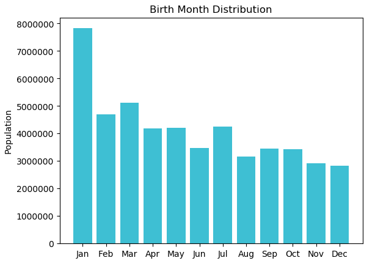

# Spark Project Report1
### E1

#### Method
Male in Turkish is 'Erkek' and female in Turkish is 'Kadın'. So male is represented by 'E'.
#### Analysis
The result shows that the oldest man in Turkey, Celil Unal, was born on Sep 20,1329. This is rediculous and must have been a wrong record.
### E1-2
#### Method
#### Analysis
'1/1/1966' is the most popular birthdate, while '2/9/1909','8/2/1910',etc. are the least popular birthdates.The least popular birthdates are relatively early. I also found that the most popular birthday is '1/1', which might be because the default birthday was set to '1/1'.The least popular birthdate also include some obviously wrong records such as: '0/1/1963'.
### E2
#### Method
#### Analysis
The most popular character in name is A.

### E3
#### Method
#### Analysis

Since the dataset does not have records of people under 18, we could not know the number of people aged 0-18. According to the result, the most populous age range is mid-aged(29-38) and old (>=60). There is a sharp decrease on young people. However, we could not conclude on the age structure of Turkey, because the dataset does not include every person in Turkey and might be biased.

### E4
#### Method
#### Analysis

We could see that more people was born in the first half of the year. However, the peak in Jan. might be caused by the default birthday '1/1'.

### E5
#### Method

#### Analysis

The sex ratio is about 100:102. The life expectancy of men tends to be shorter than women and thus men die earlier in life. Thus, old population tends to have a very high proportion of women to men. Since the dataset does not include people aged 0-18, it is common that we have more females than males.

### N1
#### Method
#### Analysis

The male and female's most popular surnames are most identical, the the same 10 surnames and the same order. It makes sense becuase man and woman get their surnames from their parents equally.

### N2&3
#### Method
#### Analysis

The average age is not accurate because the dataset is biased (without people aged 0-18). However, the order matters. The 5 cities with the least average ages are: HAKKARI, SIRNAK, VAN, SANLIURFA, BATMAN.

Similarly, 

### N4
#### Method
#### Analysis
### N5
#### Method
#### Analysis
